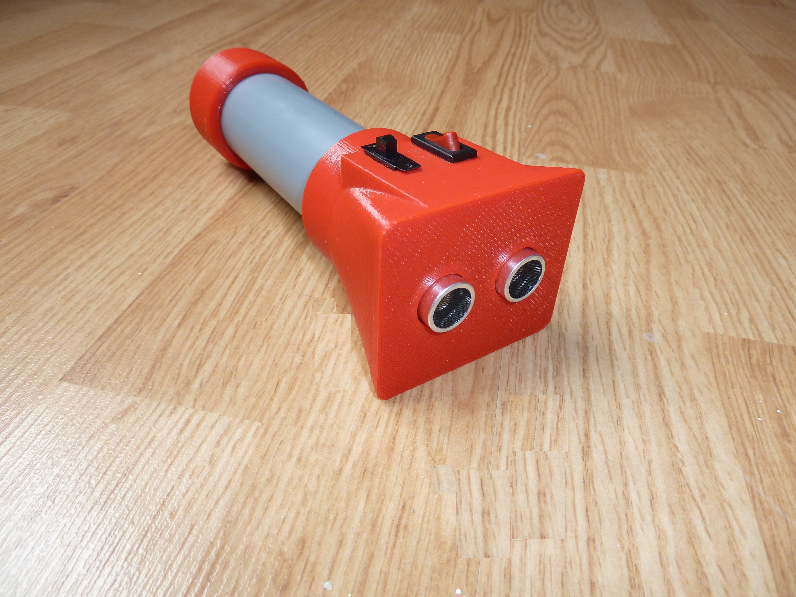

[English](https://github.com/mircea-vutcovici/blind-sonic) [română](https://github.com/mircea-vutcovici/blind-sonic/blob/master/README.ro.md)
# BlindSonic
Device used for blind people to find objects using an ultrasonic distance sensor

## History
This project is created by Cosmin Vatra. He did all the work of testing and creating the first prototypes.
Here, with his permission, I am just publising it.

## Bill of materials
The list of materials required: [English](https://github.com/mircea-vutcovici/blind-sonic/blob/master/BOM.md), [română](https://github.com/mircea-vutcovici/blind-sonic/blob/master/BOM.ro.md)

## Links to similar projects
* [How to Make a Smart Cane for the Visually Impaired With Arduino](https://maker.pro/projects/arduino/arduino-smart-cane-for-the-blind)
* [WeWALK Smart Cane](https://www.indiegogo.com/projects/revolutionary-smart-cane-for-the-visually-impaired#/)
