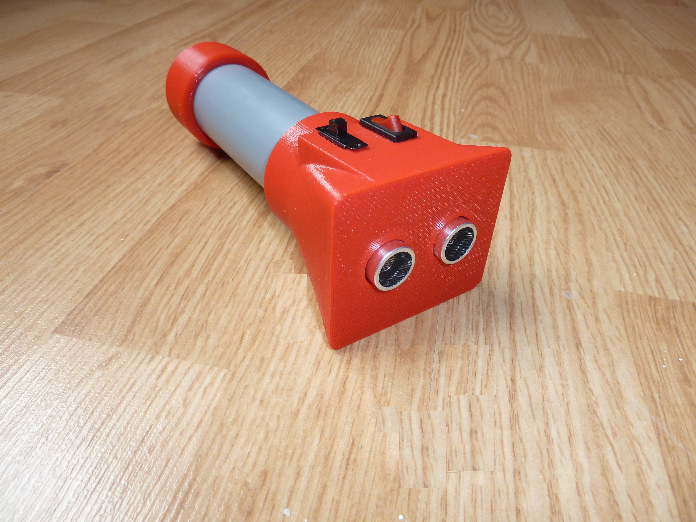

[English](https://github.com/mircea-vutcovici/blind-sonic) [română](https://github.com/mircea-vutcovici/blind-sonic/blob/master/README.ro.md)
# BlindSonic
Dispositiv pentru orientare destinat persoanelor care nu vad.

## Cronologie
Acest proiect a fost facut de Cosmin Vatra. El a conceput si facut primele prototipuri.
Cu permisiunea lui am publicat aceste detalii.

## Lista de materiale
[English](https://github.com/mircea-vutcovici/blind-sonic/blob/master/BOM.md), [română](https://github.com/mircea-vutcovici/blind-sonic/blob/master/BOM.ro.md)

## Legaturi catre proiecte similare
* [How to Make a Smart Cane for the Visually Impaired With Arduino](https://maker.pro/projects/arduino/arduino-smart-cane-for-the-blind)
* [WeWALK Smart Cane](https://www.indiegogo.com/projects/revolutionary-smart-cane-for-the-visually-impaired#/)
